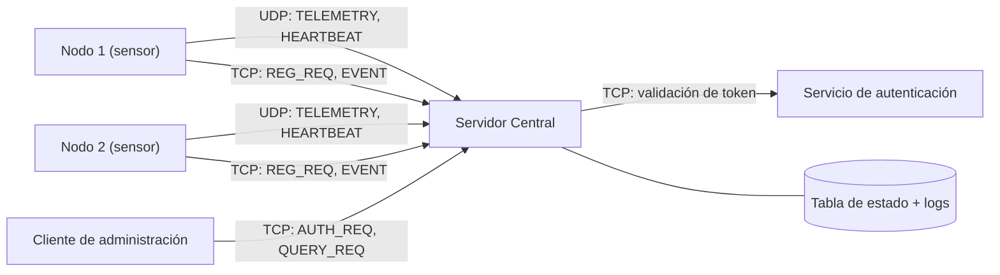
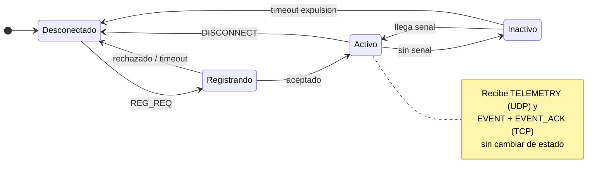
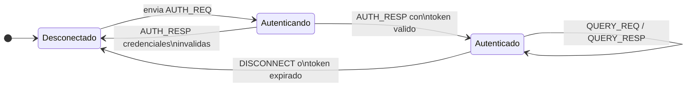
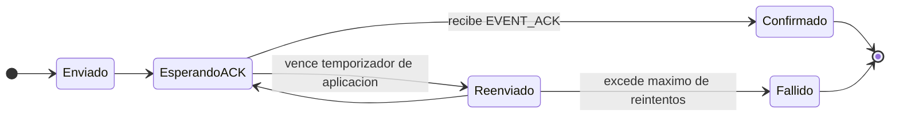

# Fase 1 — Diseño y arquitectura
## Sistema de Monitoreo y Control Distribuido

**Curso:** Internet: Arquitectura y Protocolos, Telemática — 2026-2
**Proyecto:** Sistema de monitoreo control y distribuido
**Fase:** 1 de 3 — Diseño y arquitectura
**Integrante:** Sebastian Andres Medina Cabezas

---

Este documento presenta la propuesta inicial del proyecto, conforme a lo solicitado para la Fase 1: descripción del problema, arquitectura, entidades participantes, tipos de mensajes, sintaxis preliminar, reglas básicas de comunicación, máquinas de estado y un análisis preliminar sobre el uso de TCP y UDP. La sintaxis exacta de los mensajes y el detalle de las reglas de procedimiento se terminarán de ajustar durante la implementación en las fases 2 y 3, a medida que se resuelvan los detalles que solo aparecen al programar contra la API de sockets.

## 1. Descripción general del problema

Se busca implementar un sistema de monitoreo para una infraestructura tecnológica distribuida: varios nodos (sensores, equipos de red o dispositivos IoT) deben reportar su estado de forma remota a un servidor central. Cada nodo produce dos clases de información con requerimientos distintos.

Por un lado está la **telemetría periódica** — uso de CPU, temperatura, nivel de batería, estado operativo, disponibilidad y métricas de funcionamiento — donde perder una muestra ocasional no es grave, porque la siguiente actualización llega poco después y deja el estado al día de todas formas. Por otro lado están los **eventos críticos** — fallas, superación de umbrales, pérdida de conectividad, alarmas, cambios de estado — donde perder un solo mensaje sí puede tener consecuencias, porque no hay una "siguiente muestra" que lo reemplace.

El servidor central debe registrar los nodos, procesar ambos tipos de información, mantener un estado consolidado de toda la infraestructura y atender consultas de uno o varios clientes de administración autenticados, que a su vez revisan tanto el estado instantáneo como el histórico reciente de cada nodo. Nodos y clientes nunca se comunican entre sí de forma directa: toda interacción pasa por el servidor central, que es el único punto de coordinación del sistema.

Esta diferencia de exigencias entre telemetría y eventos es, en la práctica, el problema central de diseño: define qué transporte usar para cada tipo de mensaje y qué mecanismos adicionales de confiabilidad hacen falta cuando se elige un transporte no orientado a conexión.

## 2. Arquitectura propuesta

La arquitectura mínima está compuesta por cuatro tipos de componentes: **nodos**, **servidor central**, **servicio de autenticación** y **clientes de administración**. Nodos y clientes nunca establecen conexión directa entre ellos; toda comunicación pasa por el servidor central.



### 2.1 Entidades participantes

**Nodo.** Proceso que simula un sensor, un equipo de red o un dispositivo IoT. Se registra ante el servidor al arrancar, envía telemetría periódica por UDP mientras está activo, y reporta eventos críticos por TCP cuando ocurren. Puede implementarse en cualquier lenguaje (Python, C, Java, etc.).

**Servidor central.** Único componente que debe implementarse en C usando exclusivamente la API de Sockets Berkeley. Registra nodos, procesa telemetría y eventos, mantiene en memoria (y en histórico) el estado de cada nodo, valida las sesiones de los clientes y responde sus consultas. Atiende conexiones TCP concurrentes usando un hilo por conexión entrante; las muestras UDP se procesan en un hilo dedicado que actualiza la tabla de estado bajo exclusión mutua con los hilos TCP, para evitar condiciones de carrera sobre la misma estructura. Registra cada petición y respuesta en consola y en el archivo de logs indicado por parámetro, junto con la IP y el puerto de origen del cliente o nodo correspondiente.

**Servicio de autenticación.** Componente separado de la aplicación principal, con su propio almacenamiento de credenciales y perfiles de usuario (por ejemplo, roles como *administrador* y *operador* con distintos permisos de consulta). Valida las credenciales que le llegan desde el servidor central y emite un token de sesión; el servidor central usa ese token para autorizar cada consulta posterior sin tener que reenviar la contraseña. Mantenerlo separado evita el escenario que el enunciado pide evitar: un sistema de usuarios basado únicamente en archivos locales o en la base de datos propia de la aplicación principal.

**Cliente de administración.** Aplicación con una interfaz simple que se autentica contra el sistema y consulta el estado instantáneo y al menos cinco datos históricos de los nodos. Puede implementarse en cualquier lenguaje.

## 3. Protocolo de aplicación: PMCD/1.0

**PMCD** (Protocolo de Monitoreo y Control Distribuido) es el protocolo de capa de aplicación diseñado para este sistema. Opera sobre TCP/IP, siguiendo un modelo cliente-servidor en el que dos tipos de entidades actúan como clientes del servidor central: los nodos y los clientes de administración.

### 3.1 Tipos de mensajes

| Código | Mensaje | Transporte | Dirección | Descripción |
|---|---|---|---|---|
| 0x01 | `REG_REQ` | TCP | Nodo → Servidor | Solicitud de registro de un nodo |
| 0x02 | `REG_RESP` | TCP | Servidor → Nodo | Confirmación o rechazo del registro |
| 0x03 | `AUTH_REQ` | TCP | Cliente → Servidor | Solicitud de autenticación de un cliente |
| 0x04 | `AUTH_RESP` | TCP | Servidor → Cliente | Resultado de la autenticación (token o error) |
| 0x05 | `TELEMETRY` | UDP | Nodo → Servidor | Reporte periódico de métricas de estado |
| 0x06 | `EVENT` | TCP | Nodo → Servidor | Notificación de un evento crítico |
| 0x07 | `EVENT_ACK` | TCP | Servidor → Nodo | Confirmación de que el evento fue procesado |
| 0x08 | `QUERY_REQ` | TCP | Cliente → Servidor | Consulta de estado instantáneo o histórico |
| 0x09 | `QUERY_RESP` | TCP | Servidor → Cliente | Respuesta a una consulta |
| 0x0A | `HEARTBEAT` | UDP | Nodo → Servidor | Señal de vida cuando no hay telemetría reciente que enviar |
| 0x0B | `ERROR` | TCP / UDP | Servidor → Nodo o Cliente | Reporte de error de procesamiento |
| 0x0C | `DISCONNECT` | TCP | Nodo o Cliente → Servidor | Cierre voluntario de sesión |

### 3.2 Sintaxis preliminar

Cada mensaje PMCD tiene un encabezado binario de tamaño fijo (16 bytes, para facilitar el empaquetado con structs en C) seguido de un cuerpo de texto en UTF-8:

| Campo | Tamaño | Descripción |
|---|---|---|
| `MAGIC` | 2 bytes | Identificador fijo del protocolo: `0x50 0x4D` ("PM") |
| `VERSION` | 1 byte | Versión del protocolo (`0x01` en esta propuesta) |
| `TYPE` | 1 byte | Código del tipo de mensaje, según la tabla anterior |
| `FLAGS` | 1 byte | Bits de control (ver detalle abajo) |
| `SEQ_NUM` | 4 bytes | Número de secuencia asignado por el emisor, usado para correlacionar solicitudes con respuestas y para detectar duplicados o reintentos |
| `TIMESTAMP` | 4 bytes | Marca de tiempo Unix del envío del mensaje |
| `PAYLOAD_LEN` | 2 bytes | Longitud en bytes del cuerpo del mensaje |
| `RESERVED` | 1 byte | Reservado para uso futuro (alineación a 16 bytes) |
| `PAYLOAD` | variable | Cuerpo del mensaje |

`FLAGS` — bit 0: `REQUIERE_ACK` (el emisor espera confirmación explícita); bit 1: `ES_RESPUESTA` (el mensaje responde a otro correlacionado por `SEQ_NUM`); bit 2: `REENVIO` (es un reintento de un `SEQ_NUM` ya enviado); bits 3–7: reservados.

El cuerpo (`PAYLOAD`) se codifica como texto plano, en pares `campo=valor` separados por `;`, sin depender de una librería externa de serialización (algo relevante porque el servidor solo puede usar la API de sockets, sin librerías adicionales para parsear JSON u otros formatos):

```
nodo_id=N003;cpu=42.5;temp=36.1;bateria=88;estado=ACTIVO
```

Esta sintaxis es preliminar: en la Fase 2, al implementar el empaquetado/desempaquetado real en C, es posible que se ajusten nombres de campos o se agregue algún carácter de escape para valores que contengan `;` o `=`.

### 3.3 Ejemplos de mensajes

**Registro de un nodo** (`REG_REQ`):
```
nodo_id=N003;tipo=sensor_temperatura;capacidades=telemetria,eventos
```

**Telemetría periódica** (`TELEMETRY`):
```
nodo_id=N003;cpu=42.5;temp=36.1;bateria=88;estado=ACTIVO;disponibilidad=99.2
```

**Evento crítico** (`EVENT`):
```
nodo_id=N003;evento=UMBRAL_SUPERADO;metrica=temp;valor=85.0;umbral=80.0;severidad=ALTA
```

**Consulta de histórico** (`QUERY_REQ`):
```
token=a91fbe7c;nodo_id=N003;consulta=HISTORICO;metrica=temp;n=5
```

**Error** (`ERROR`):
```
codigo=400;descripcion=formato_invalido;campo=payload
```

## 4. Reglas básicas de comunicación

- Un nodo debe completar su registro (`REG_REQ` / `REG_RESP`) antes de poder enviar telemetría o eventos. El servidor rechaza con `ERROR` (código `NODO_NO_REGISTRADO`) cualquier mensaje proveniente de un nodo no registrado.
- `REG_REQ`, `AUTH_REQ`, `EVENT`, `QUERY_REQ` y `DISCONNECT` viajan por TCP, dentro de una conexión que el emisor abre y mantiene mientras dura la operación correspondiente.
- `TELEMETRY` y `HEARTBEAT` viajan por UDP. El servidor no responde a estos mensajes en condiciones normales; solo lo hace si detecta un error de formato, devolviendo un `ERROR` por el mismo socket UDP.
- Todo mensaje con el bit `REQUIERE_ACK` activo debe recibir, dentro de un plazo definido por un temporizador de aplicación, una respuesta correlacionada por el mismo `SEQ_NUM`. Si el plazo vence, el emisor reintenta (marcando `REENVIO`) hasta un máximo de intentos, después del cual da la operación por fallida.
- El servidor descarta cualquier mensaje con `MAGIC` o `VERSION` inválidos. Si llegó por TCP, responde `ERROR` porque ya existe una conexión que lo justifica; si llegó por UDP, simplemente lo descarta, dado el carácter no orientado a conexión de ese transporte. En ambos casos el intento queda registrado en el log.
- El servidor mantiene una tabla de nodos registrados y otra de sesiones de cliente autenticadas. Toda operación `QUERY_REQ` debe incluir un token válido en el payload; si el token falta, es inválido o expiró, el servidor responde `ERROR` (código `NO_AUTORIZADO`).
- El servidor central y el servicio de autenticación se identifican por nombre de dominio, nunca por IP fija en el código. La resolución se hace mediante `getaddrinfo()` (o equivalente); si falla, el componente que la invoca registra el error y reintenta sin terminar su ejecución.

## 5. Máquinas de estado

### 5.1 Estado de un nodo (vista del servidor)



Un nodo entra en `Inactivo` cuando el servidor deja de recibir telemetría o heartbeats durante un intervalo configurado; esto permite distinguir un nodo que simplemente no tiene nada nuevo que reportar de uno que perdió conectividad. Si sigue inactivo más allá de un segundo temporizador, el servidor lo da de baja y exige un nuevo registro.

### 5.2 Estado de sesión de un cliente de administración



### 5.3 Entrega confiable de un evento (nivel de aplicación)



Aunque `EVENT` viaja por TCP —que ya garantiza la entrega de los bytes a nivel de transporte—, el `EVENT_ACK` es una confirmación de aplicación: certifica que el servidor efectivamente procesó y registró el evento, no solo que los bytes llegaron al socket. Esa distinción entre "llegó" y "se procesó" es la que justifica mantener este mecanismo incluso sobre un transporte confiable.

## 6. Análisis preliminar: selección de TCP y UDP

| Criterio | Telemetría / heartbeat | Eventos críticos | Registro, autenticación y consultas |
|---|---|---|---|
| Frecuencia | Alta (cada pocos segundos) | Baja, esporádica | Baja, por sesión |
| Tamaño del mensaje | Pequeño | Pequeño-mediano | Pequeño-mediano |
| Criticidad de la información | Baja-media | Alta | Media-alta |
| Tolerancia a pérdida | Alta | Ninguna | Ninguna |
| Necesidad de orden | Baja (cada muestra es independiente) | Media | Alta |
| Necesidad de confiabilidad | Baja | Alta | Alta |
| Necesidad de conexión persistente | No | No (transacción corta) | Sí, durante la sesión |
| Comportamiento ante pérdida | Se descarta y se espera la siguiente muestra | Reintento a nivel de aplicación | La operación no continúa sin respuesta |
| **Transporte elegido** | **UDP** | **TCP** | **TCP** |

La arquitectura resultante combina ambos transportes, con una justificación distinta para cada uno:

**UDP para telemetría y heartbeat.** Dado que la información se actualiza con tanta frecuencia, una muestra perdida queda reemplazada por la siguiente en pocos segundos, y el costo de establecer conexión o de esperar retransmisiones sería mayor que el beneficio. Por eso, deliberadamente, **no** se añaden mecanismos propios de confiabilidad (sin ACK, sin retransmisión) para este tipo de mensaje: el propio enunciado invita a evaluar cuándo *no* conviene agregarlos, y este es ese caso.

**TCP para registro, autenticación, eventos y consultas.** Todos comparten que una pérdida sí importa, que hay una secuencia lógica que debe respetarse (por ejemplo, no tiene sentido consultar sin haberse autenticado antes) y que ocurren con una frecuencia lo bastante baja como para que el costo de una conexión TCP sea insignificante frente al riesgo de perder el mensaje. En particular, para `EVENT` se optó por TCP en vez de UDP con mecanismos propios de retransmisión: como los eventos son poco frecuentes, el overhead de TCP no compromete el desempeño del sistema, y evita reimplementar mecanismos que TCP ya resuelve a nivel de transporte (numeración, retransmisión, control de duplicados).

Esta decisión se revisará durante la Fase 2, al enfrentar la implementación real de los sockets, y se ajustará si el comportamiento observado lo justifica.
